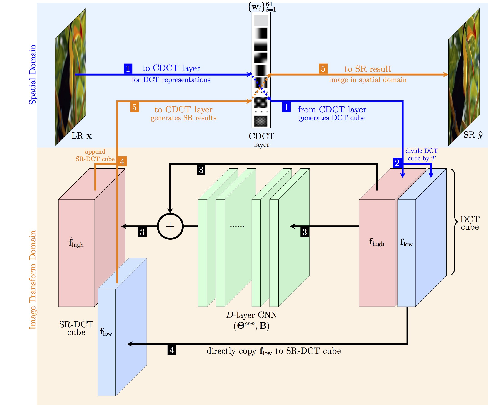

# ORDSR
*UPDATED Jan 31 2019*

## Introduction 

Deep learning methods, in particular trained Convolutional Neural Networks (CNNs) have recently been shown to produce compelling state-of-the-art results for single image Super-Resolution (SR). Invariably, a CNN is learned to map the low resolution (LR) image to its corresponding high resolution (HR) version in the spatial domain. Aiming for faster inference and more efficient solutions than solving the SR problem in the spatial domain, we propose a novel network structure for learning the SR mapping function in an image transform domain, specifically the Discrete Cosine Transform (DCT). As a first contribution, we show that DCT can be integrated into the network structure as a Convolutional DCT (CDCT) layer. We further extend the network to allow the CDCT layer to become trainable (i.e. _optimizable_). Because this layer represents an image transform, we enforce pairwise orthogonality constraints on the individual basis functions/filters. This Orthogonally Regularized Deep SR network (ORDSR) simplifies the SR task by taking advantage of image transform domain while adapting the design of transform basis to the training image set. Experimental results show ORDSR achieves state-of-the-art SR image quality with fewer parameters than most of the deep CNN methods.

## Reports and slides

Please find details about CDCT layer and ORDSR in our [technical report](http://signal.ee.psu.edu/research/ORDSR_files/techReport.pdf).
Please find step-by-step CDCT layer DCT and IDCT illustration in this [slide](http://signal.ee.psu.edu/research/ORDSR_files/ORDSR_CDCT.pdf).

## Structure

